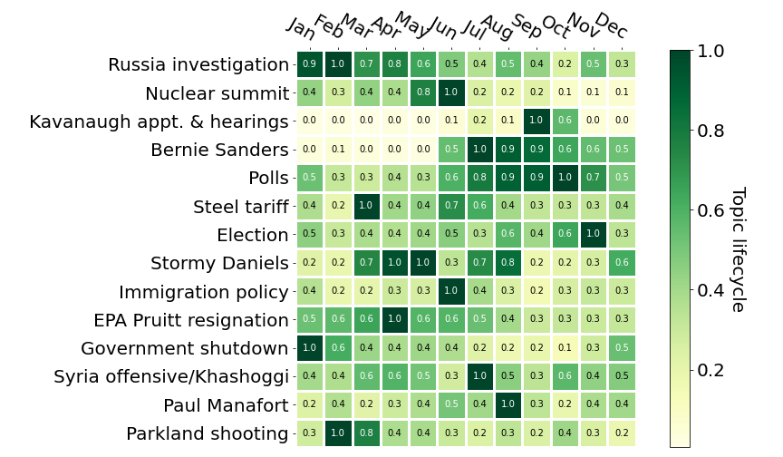

# Media in the Midterms

*What and how did the media cover in 2018 and what can we expect in 2022.*

This Github repositoy contains our project for the May 2022 Data Science Bootcamp
organized by the Erdos Institute. Our team (Kepler) is integrated by:

Martin Molina-Fructuoso 

Jaychandran Padayasi

Aidan Zabalo

Gleb Zhelezov

# Introduction

2022 is a midterm election year. The 2016 election showed that news publications and social media platforms strongly influence the outcome of elections. To formulate a lasting message, political campaign managers want to know:
- The issues that trend in the media
- The typical life of a story
- The optimal time to release a story for maximizing impact

With this project we aimed to identify and track critical issues in the 2018 midterm election. We believe that our analysis of the coverage these stories received by different media outlets over time is very valuable for designing new campaigning strategies.

# Methods
We used the [components.one](https://components.one/datasets/all-the-news-2-news-articles-dataset/) dataset of around 2.7 million articles and essays scraped from 27 outlets. Although some of the articles in this collection are correctly classified into sections, most are not. To increase the pool of political articles available for our analysis we used a suppoert vector machine (SVM) and random forest binary classifier to detect political stories in the dataset that were not labeled as such.

We tried two topic modeling techniques, Nonnegative Matrix Factorization (NMF) and Latent Semantic Analysis (LSA), to identify the most important stories of 2018. We observed that NMF produced a much clearer topic differentiation.

We used this model to visualize the lifecycle of the different stories by analyzing the number of articles published on a topic every month. 

Additionally, we defined a myopicity index that tells us what fraction of a publication's total articles is dedicated to a single issue. For example, we found that People magazine focuses 75% of its articles on its dominant story (high myopicity index), whereas CNBC focuses on multiple stories at a time (low myopicity index). We learned that an important piece of news should be published by a media outlet with high myopicity if one hopes to maximize its impact. 

For more details see the [notebook](https://github.com/glebzhelezov/Erdos_project/blob/main/notebooks/2018_election.ipynb) and the [executive summary](https://github.com/glebzhelezov/Erdos_project/blob/main/writeups/executive_summary.md).

# Required python libraries to run notebook:
- [NumPy](https://numpy.org/)
- [matplotlib](https://matplotlib.org/)
- [SQLAlchemy](https://www.sqlalchemy.org/)
- [scikit-learn](https://scikit-learn.org/stable/index.html)
- [word_cloud](https://github.com/amueller/word_cloud)
- [spaCy](https://spacy.io/)
